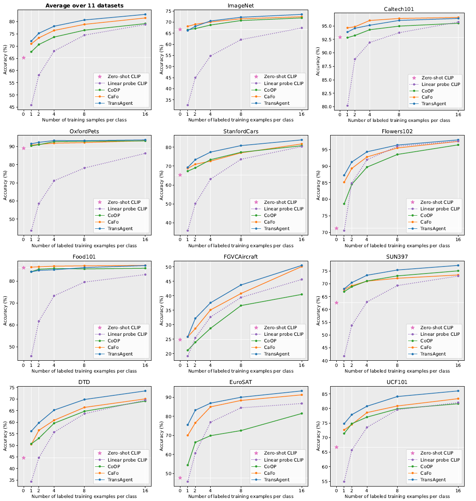

# TransAgent

> [**TransAgent: Transfer Vision-Language Foundation Models with Heterogeneous Agent Collaboration**](https://arxiv.org/abs/2410.12183)<br>
> [Yiwei Guo](https://github.com/markywg), [Shaobin Zhuang](https://scholar.google.com/citations?user=PGaDirMAAAAJ&hl=zh-CN&oi=ao), [Kunchang Li](https://scholar.google.com/citations?user=D4tLSbsAAAAJ), [Yu Qiao](https://scholar.google.com/citations?user=gFtI-8QAAAAJ&hl), [Yali Wang](https://scholar.google.com/citations?user=hD948dkAAAAJ).


## Update
- **2024/10/17**: Training/Evaluation codes for TransAgent are released.

<hr />

## Introduction


To our best knowledge, TransAgent is the _first_ unified distillation framework for generalizing vision-language foundation
models with _efficient_ heterogeneous agent collaboration. It contains three key characteristics:
- **Knowledge Versatility.** TransAgent leverages 11 heterogeneous agents from vision,
language and multi-modal research, which comprehensively covers diversified knowledge that is
complementary with CLIP-like models.
- **Transfer Flexibility.** Mixture-of-agents (MoA) gating mechanism is proposed to integrate external knowledge of
different agents in each modality.
- **Deployment Efficiency.** Multi-source distillation is applied to transfer knowledge of heterogeneous agents into CLIP, along with prompt learning,
achieving deployment efficiency without a heavy model ensemble.


## Comparison with state-of-the-art methods
### Base-to-Novel Generalization
| Name                                          | Base Acc. | Novel Acc. |    HM     | Epochs | 
|-----------------------------------------------|:---------:|:----------:|:---------:|:------:|
| [CLIP](https://arxiv.org/abs/2103.00020)      |   69.34   |   74.22    |   71.70   |   -    |  
| [CoOp](https://arxiv.org/abs/2109.01134)      |   82.69   |   63.22    |   71.66   |  200   | 
| [CoCoOp](https://arxiv.org/abs/2203.05557)    |   80.47   |   71.69    |   75.83   |   10   | 
| [MaPLe](https://arxiv.org/abs/2210.03117)     |   82.28   |   75.14    |   78.55   |   5    |
| [PromptSRC](https://arxiv.org/abs/2307.06948) |   84.26   |   76.10    |   79.97   |   20   |
| TransAgent (Ours)                             | **85.29** | **77.62**  | **81.27** |   20   |  

### Few-Shot Classification


## Preparation

Follow the instructions in [INSTALL.md](docs/INSTALL.md) and [DATASETS.md](docs/DATASETS.md) to prepare the environment and datasets.


## Training & Evaluation
Refer to the [TRAIN.md](docs/TRAIN.md) for detailed instructions on training and evaluating TransAgent from scratch.


<hr />

## Cite
If you find this repository useful in your research, please use the following BibTeX entry for citation:

```latex
@article{guo2024transagent,
  title={TransAgent: Transfer Vision-Language Foundation Models with Heterogeneous Agent Collaboration},
  author={Yiwei Guo, Shaobin Zhuang, Kunchang Li, Yu Qiao, Yali Wang},
  journal={Advances in neural information processing systems},
  year={2024}
}
```


## Acknowledgement

This repository is built based on [CoOp and Co-CoOp](https://github.com/KaiyangZhou/CoOp), [MaPLe](https://github.com/muzairkhattak/multimodal-prompt-learning), [PromptSRC](https://github.com/muzairkhattak/PromptSRC), [VPD](https://github.com/wl-zhao/VPD) and [ProText](https://github.com/muzairkhattak/ProText).
